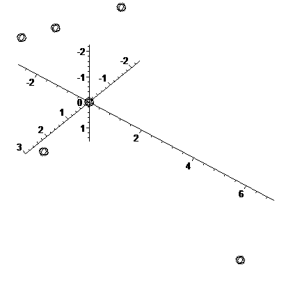

_Automatically exported from https://code.google.com/archive/p/modelling-glass-structur/_

Санкт-Петербургский государственный университет информационных технологий, механики и оптики

# Дипломный проект

### Тема "Моделирование структуры стекла"
подготовил: ст-т 4 курса ФФиОИ гр 4351 _Aбдуcaламoв Apсен Мaгoмeдсаидoвич_

научный руководитель: _Пржевуский Александр Кириллович_ 
